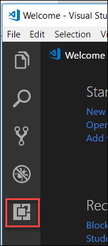
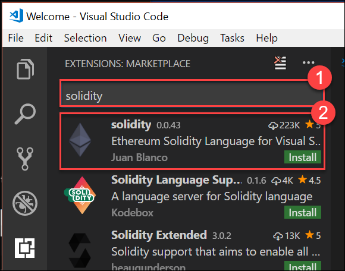
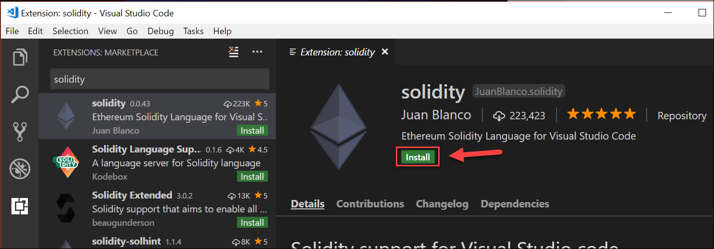
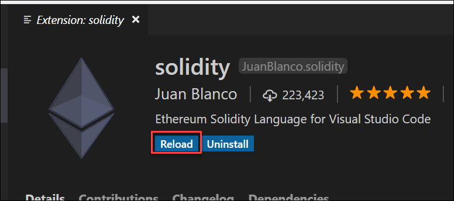

# Azure Blockchain setup

## Requirements

1.  An Azure Subscription

## Before the hands-on lab

Duration: 15 minutes

In this exercise, you will set up the necessary tools you will need to use for the rest of the exercises.

### Task 1: Install Visual Studio Code

1.  Download and install Visual Studio Code onto the development machine. You can download it from: <https://code.visualstudio.com/>

2.  Run **Visual Studio Code**

3.  Click on the **Extensions** tab on the left-side of the window.

    

4.  Type **Solidity** into the *Search Extensions in Marketplace* box, and click on the **solidity** extension authored by **Juan Blanco**.

    

5.  On the **solidity** extension, click **Install** to install this extension into Visual Studio Code.

    

6.  Click **Reload** to refresh the Visual Studio Code editor to include this new plugin for use.

    

7.  Visual Studio Code is now ready to edit Solidity (.sol) code files with syntax highlighting and other IDE features

You should follow all steps provided *before* attending the hands-on lab.